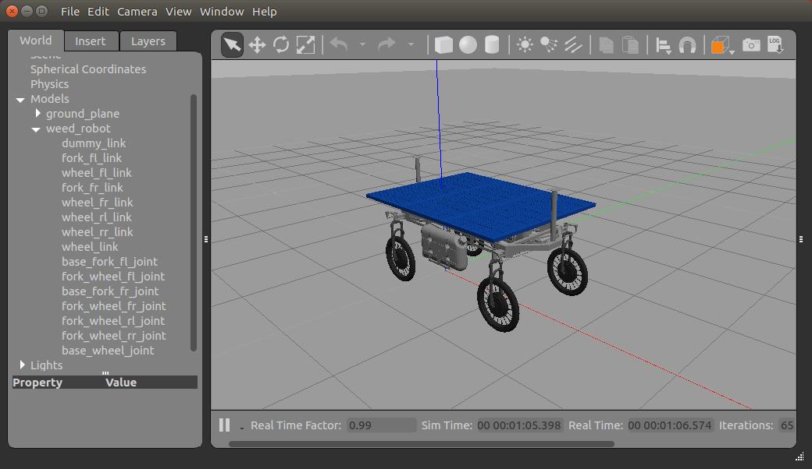

# weed_robot_gazebo

Simulación del robot desmalezador en Gazebo.

Para ejecutar la simulación usar [launch/gazebo.launch](launch/gazebo.launch). Este lanzador carga el modelo a partir de lo definido en el archivo [urdf/gazebo.xacro](urdf/gazebo.xacro), que a su vez utiliza la descripción del robot del paquete [weed_robot_description](https://repositorio.cifasis-conicet.gov.ar/rodes/weed_robot_description). Si se ejecuta con el parámetro *meshes:=false*, se utilizará un modelo simplificado formado por figuras geométricas básicas, lo cual hace que la simulación consuma considerablemente menos recursos.



Se implementó el nodo [src/world_odom_publisher.cpp](src/world_odom_publisher.cpp) que publica el *ground-truth* de la odometría obtenida desde la ubicación real del robot en Gazebo.

La carpeta [meshes](meshes) contiene mallas 3D en formato STL de 3 plantas de soja de diferentes tamaños y formas. Estas mallas están separadas por nivel de resolución en carpetas. Los escenarios de simulación [worlds/field_plants.world](worlds/field_plants.world) y [worlds/field_small_plants.world](worlds/field_small_plants.world) utilizan estas mallas en su versión de menor resolución.

El script [utils/world_generator.py](utils/world_generator.py) se utiliza para generar escenarios de simulación *world*.
Se pueden configurar características del campo como sus dimensiones, cabeceras, ancho de surcos, etc.
Por otro lado, las hileras de cultivos se pueden generar con cajas simples o con las mallas de plantas y el suelo se puede generar con o sin textura.

Para agregar el control del robot usar [launch/control.launch](launch/control.launch). Como control se utiliza el paquete [steer_drive_controller](http://wiki.ros.org/steer_drive_controller). El mismo se suscribe al topic */steer_drive_controller/cmd_vel* donde recibe mensajes del tipo [geometry_msgs/Twist Message](http://docs.ros.org/melodic/api/geometry_msgs/html/msg/Twist.html). De dichos mensajes solo se utilizan los componentes **linear.x** y **angular.z**, el resto se ignora.

Para comandar el robot mediante el teclado se puede hacer uso del paquete [teleop_twist_keyboard](http://wiki.ros.org/teleop_twist_keyboard) redirigiendo el topic en el cual publica de la siguiente manera:

```
$ rosrun teleop_twist_keyboard teleop_twist_keyboard.py cmd_vel:=/steer_drive_controller/cmd_vel
```
